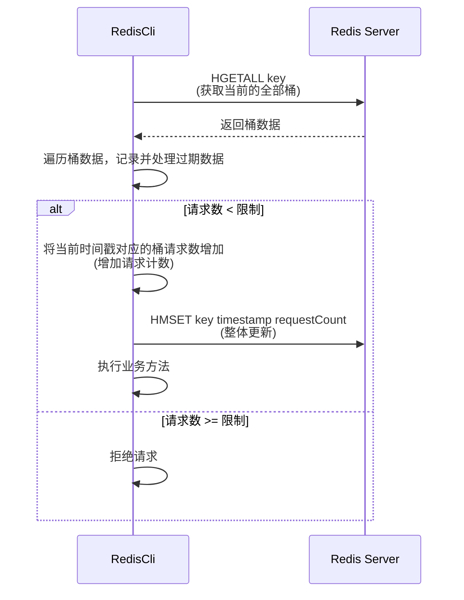

基于 :term[Redisson]{./blog/terms/java#redisson} 的:term[滑动时间窗口]{./blog/terms/net#sliding-window-protocol}限流器实现。

<!--truncate-->

import Steps from "@site/src/components/Steps";
import { Center } from "@site/src/components/Image";
import Mermaid from "@theme/Mermaid";
import { Text } from "@site/src/components/Typography";
import { Collapse } from "@site/src/components/Collapse";

## 概览

### 限流器

限流器一词起源于电气工程，在电路中，固定电阻可起到降低电流的作用，达到保护电路的目的。
后面随着计算机网络发展，流字被赋予了**流量**的含义，限流器也就有了**限制流量**的含义。

## 原理和设计

> 使用 Redis HashMap 结构实现令牌桶，使用 timestamp 作为桶的 key，使用请求数作为桶的 value。

### 基于令牌桶的滑动时间窗

- 窗口大小设置为 10, :term[令牌桶]{./blog/terms/net#token-bucket}数量为 10
- 窗口内允许请求数量为 100
- 单个桶放行请求数量为 10

<Steps
  current={0}
  direction="vertical"
  items={[
    {
      title: <Text>第 1 秒统计，请求数为 10</Text>,
      key: "1",
      description: (
        <Mermaid
          value={`
xychart-beta
title "滑动时间窗口桶请求统计"
x-axis [1, 2, 3, 4, 5, 6, 7, 8, 9, 10]
y-axis "请求数" 0 --> 15
bar [10, 0, 0, 0, 0, 0, 0, 0, 0, 0]
bar [10, 0, 0, 0, 0, 0, 0, 0, 0, 0]
      `}
        />
      ),
    },
    {
      title: "第 6 秒统计，过去 6 秒请求总数为 65, 拒绝 5 个请求",
      key: "2",
      description: (
        <>
          <Mermaid
            value={`
xychart-beta
title "滑动时间窗口桶请求统计"
x-axis [1, 2, 3, 4, 5, 6, 7, 8, 9, 10]
y-axis "请求数" 0 --> 15
bar [10, 12, 8, 14, 9, 12, 0, 0, 0, 0]
bar [10, 12, 8, 14, 9, 12, 0, 0, 0, 0]
bar [0, 2, 0, 2, 0, 1, 0, 0, 0, 0]
      `}
          />
          <Text type="danger">
            第 2，4，6 桶位存在被拒绝请求，用其他颜色替代
          </Text>
        </>
      ),
    },
    {
      title: "第 10 秒统计，过去的 10 秒请求总数为 109, 拒绝 9 个请求",
      key: "3",
      description: (
        <>
          <Mermaid
            value={`
xychart-beta
title "滑动时间窗口桶请求统计"
x-axis [1, 2, 3, 4, 5, 6, 7, 8, 9, 10]
y-axis "请求数" 0 --> 15
bar [10, 12, 8, 14, 9, 12, 13, 11, 10, 10]
bar [10, 12, 8, 14, 9, 12, 13, 11, 10, 10]
bar [0, 2, 0, 2, 0, 1, 3, 1, 0, 0]
        `}
          />
          <Text type="danger">
            第 2，4，6，7，8 桶位存在被拒绝请求，用其他颜色替代
          </Text>
        </>
      ),
    },
    {
      title: "第 12 秒统计，过去的 12 秒请求总数为 110, 拒绝 10 个请求",
      key: "3",
      description: (
        <>
          <Mermaid
            value={`
xychart-beta
title "滑动时间窗口桶请求统计"
x-axis [1, 2, 3, 4, 5, 6, 7, 8, 9, 10]
y-axis "请求数" 0 --> 15
bar [10, 9, 8, 14, 9, 12, 13, 11, 10, 10]
bar [10, 9, 8, 14, 9, 12, 13, 11, 10, 10]
bar [4, 0, 0, 2, 0, 1, 3, 1, 0, 0]
bar [14, 9, 0, 0, 0, 0, 0, 0, 0, 0]
        `}
          />
          <Text type="danger">第1，2桶位被覆盖，用其他的颜色表示</Text>
        </>
      ),
    },
  ]}
/>

### 交互图



### 代码实现

> 基于 Reactive Redisson

<Collapse label="SlidingWindowRateLimiter.java">

```java file=_codes/SlidingWindowRateLimiter.java title="/src/com/github/heliannuuthus/clfs/SlidingWindowRateLimiter.java" showLineNumbers

```

</Collapse>

#### 拓展性思考

1. 该种方式与 `动态字符串` 以及 `Z-SET` 的区别是什么？有什么优缺点？
2. 将配置项抽象到 ConfigurationProperties 内可实现动态窗口，但是如何解决配置变更的边界问题？
3. 需要降级实现，当 Redis 不可用时，可以切换为本地限流器，或者直接关闭。
4. 是否可通过统计请求数，来实现自适应的窗口？
