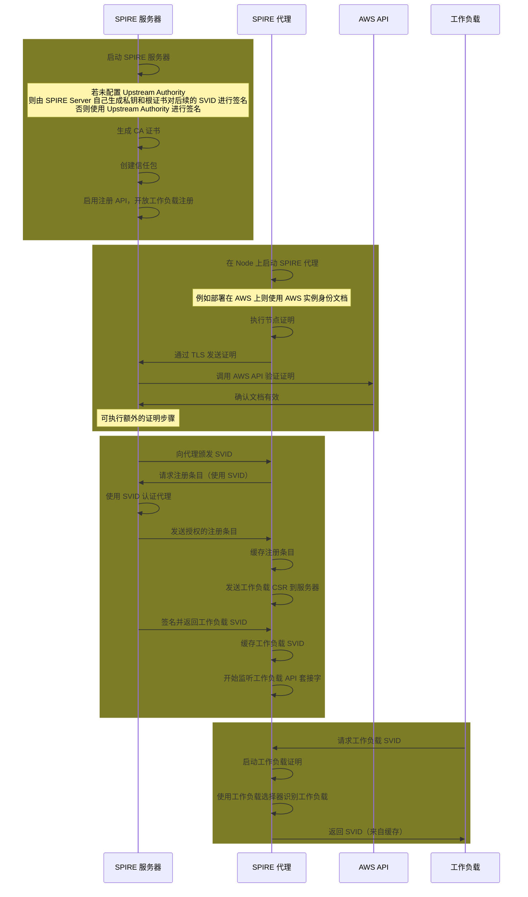

SPIFFE（Secure Production Identity Framework for Everyone），发音：_/ˈspɪfi/_，是一套开源标准，用于解决由于现代网络环境中资源动态变化（如弹性扩缩容、多运行时等）与环境复杂异构（如多云混合架构、跨平台支持等）所带来安全问题。

<!-- truncate -->

## 概览

### SPIFFE ID

> 本质是[[统一资源标识符]](/blog/terms/web#uri)，用于标识一个[工作负载](#Workload)

通常格式为：

**_:ctip[spiffe://]{title="协议名称，固定前缀"}_:ctip[trust-domain]{title="信任域，通常是组织的或集群的域名"}_:ctip[/path/service-name]{title="工作负载的标识和路径"}_**

:::note

- 需要保证 SPIFFE 是全局唯一的，不能重复
- SPIFFE 相较于 UUID 更具有可读性，更易于人类理解
- 并且也独立于 IP、DNS 等网络底层基础设施

:::

### SVID

> SVID 全称 SPIFFE Verifiable Identity Document，用于验证服务身份的凭证

SVID 通常用于验证[工作负载](#Workload)的身份，有以下两种格式：

- [[JWT]](/blog/terms/jwt#jwt)：适用于非 TLS 的场景，比如基于 HTTP Header 的认证
- [[X.509]](/blog/terms/crypto#x509)：适用于 TLS 的场景，比如需要证书的双向认证（mTLS）

并且为了保证安全性，其本身的**_有效时间通常只设置几分钟_**，并且需要**定期更新**。

### Workload

> 工作负载，通常用于标识需要身份的容器、服务或进程 ~与 k8s 的 Deployment 同名~

可以是一个 WebServer、一个数据库、一个消息队列、一个缓存服务等。

## 工作原理

SPIRE（SPIFFE Runtime Environment） 是官方给出的 SPIFFE 规范的一种实现（其他的实现可参考[官方文档](https://spiffe.io)）

### 核心组件

（作为 SVID 颁发机构，管理注册策略并向代理签发 SVID）
（部署在节点上，验证工作负载身份、颁发 SVID 并暴露 SPIFFE 工作负载 API）

SPIRE 由 SPIRE 服务器和多个 SPIRE 代理组成，SPIRE Server 作为颁发 SVID 的颁发机构（也称为签名机构），还维护并管理[工作负载](#Workload)的注册表，SPIRE Agent 通过 SPIRE Server 验证每个工作负载的身份，SPIRE Server 再为其颁发 SVID。
除此之外，SPIRE Agent 为[工作负载](#Workload)公开本地 SPIFFE 工作负载 API，工作负载可通过 SPIFFE 工作负载 API 获取 SVID 并进行身份验证。

#### SPIRE Server

SPIRE Server 由一系列的插件定义，SPIRE 也自己附带了一些插件，但是也能通过构建其他的插件来拓展 SPIRE 应对更多的场景。

- Node Attestor：通常和 SPIRE Agent 一起用于验证[工作负载](#Workload)的节点身份
- DataStore：用于存储[工作负载](#Workload)的注册信息，包括[工作负载](#Workload)注册历史、注册策略等。
- KeyManager：用于控制和管理向[工作负载](#Workload)签发的 SVID（X.509 和 JWT 格式）。
- Upstream Authority：默认情况 SPIRE Server 使用自身的服务器作为 CA，通过定义这个插件可以使用其他的 CA。

#### SPIRE Agent

> **SPIRE Agent**部署通常会部署在每个[工作负载](#Workload)所在的**节点**上，与[工作负载](#Workload)直接通信。

SPIRE Agent 的主要功能：

- 向 SPIRE Server 拉取 SVID 并将其缓存，等待[工作负载](#Workload)主动索要。
- 向节点上的[工作负载](#Workload)公开本地 SPIFFE 工作负载 API，并可证明其身份。
- 为已识别的[工作负载](#Workload)颁发 SVID。

SPIRE Agent 的组件：

- Node Attestor：与 SPIRE Server 的 Node Attestor 插件通信，用于验证[工作负载](#Workload)的节点身份
- Workload Attestor：从工作负载所在的 node 查询[工作负载](#Workload)的注册信息，再结合[工作负载](#Workload)使用注册策略时提交的属性值进行比对来验证工作负载的进程身份。
- Key Manager：生成颁发给[工作负载](#Workload)的 X.509-SVID 的私钥

### 交互流程

