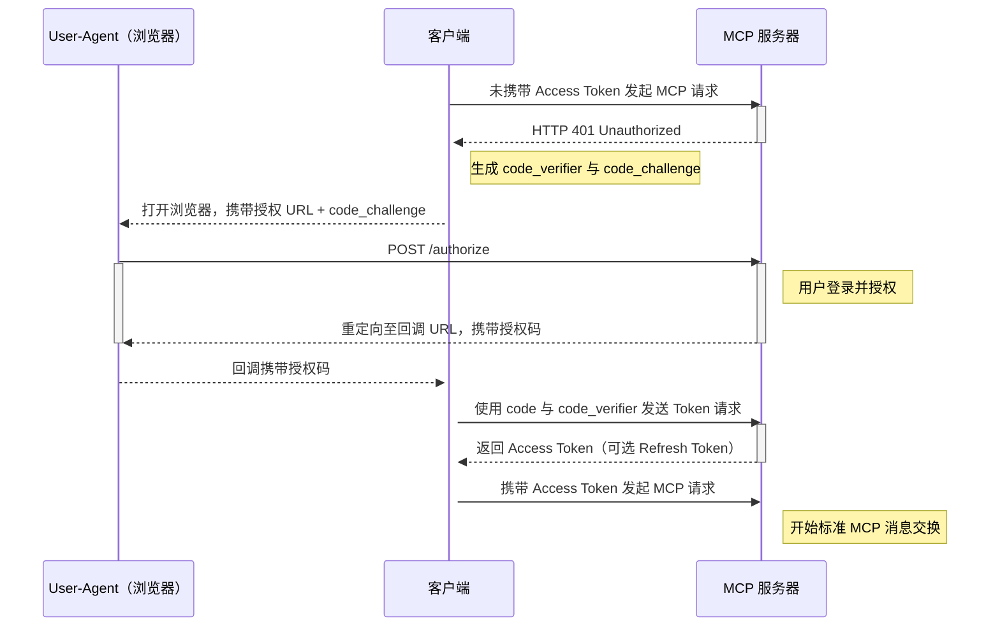

[**MCP**（Model Context Protocol）](https://github.com/modelcontextprotocol/) 是一个用于在大模型（LLM）和应用（Application）之间交互的协议，它定义了大模型和应用之间的交互方式，以及大模型和应用之间的上下文传递方式。
统一模型和应用（其实可以视为工具）之间的交互方式，让大模型可以直接使用在线应用来拓展自身能力。

MCP 从去年 10 月左右被提出，起初只有少部分活跃于 AI 开源社区的开发者关注，后续随着 [Manus](https://manus.im) 突然出现，MCP 也逐渐被大众所熟知。
在最初，是 [Claude](https://claude.ai/download) 真正的将 MCP 集成到自己的应用中，提供了非常强大的用户体验。随后 [Cursor](https://cursor.sh/)、[Cline](https://cline.ai/)、[n8n](https://n8n.io/) 等主流 AI 工具开始搭乘这次东风。
开发者们开始通过 stdio 模式将 MCP Server 注册到 MCP Host 中（其实就是一个 python 脚本）。
随着大量用户涌入社区，社区开始出现 :term[SSE]{./terms/net#sse} 模式的 MCP Server。当前模式下，MCP 可通过 `http` 或 `https` 协议来访问，并使用 :term[SSE]{./terms/net#sse} 协议来传输数据。
在 HTTP 的传统交互模式下，身份和权限是一个老生常谈的问题，在开发者使用 stdio 模式的时候这一点其实并没有很好体现。当企业想要部署可公开（并不是公网可访问）的 MCP Server 时，身份和权限就变得尤为重要。

<!--truncate-->

## 协议内容

> MCP 官网在 [2025-03-26 的规约](https://modelcontextprotocol.io/specification/2025-03-26/basic/authorization) 中提到了 MCP 的身份认证协议，并指出可借助 :term[OAuth 2.1]{./terms/auth#oauth} 使 MCP Client 可以替代用户访问受限的 MCP Server。

:::note

1. 基于 HTTP 的数据传输实现均**应该**符合该规约。
2. STDIO 依赖本地 Python 环境，故而数据传输**不应该**遵循此规范。
3. 在自定义的传输协议中，**必须**遵循对应协议的规约。

:::

协议参考 [OAuth 2.1 IETF Draft](https://datatracker.ietf.org/doc/html/draft-ietf-oauth-v2-1-01) 声明的最佳实践作为主体框架，需要 MCP Server 自行实现 [:ctip[**rfc8414**]{id="OAuth 2.0 Authorization Server Metadata"}](https://datatracker.ietf.org/doc/html/rfc8414) 定义的 `/.well-known/oauth-authorization-server` 端点为 MCP Client 提供认证的*元数据信息*。

```http
HTTP/1.1 200 OK
Content-Type: application/json

{
  "issuer": "https://auth.heliannuuthus.com/:client_id",
  "authorization_endpoint": "https://auth.heliannuuthus.com/:client_id/authorize",
  "token_endpoint": "https://auth.heliannuuthus.com/:client_id/token",
  "token_endpoint_auth_methods_supported": [
    "client_secret_basic",
    "private_key_jwt"
  ],
  "token_endpoint_auth_signing_alg_values_supported": [
    "RS256",
    "ES256"
  ],
  "userinfo_endpoint": "https://auth.heliannuuthus.com/userinfo",
  "jwks_uri": "https://auth.heliannuuthus.com/:client_id/jwks.json",
  "registration_endpoint": "https://auth.heliannuuthus.com/register",
  "scopes_supported": [
    "openid",
    "profile",
    "email",
    "address",
    "phone",
    "offline_access"
  ],
  "response_types_supported": [
    "code",
    "code token"
  ],
  "ui_locales_supported": [
    "en-US",
    "en-GB",
    "en-CA",
    "fr-FR",
    "fr-CA"
  ]
}
```

并且在协议中要求，MCP Client **必须支持**获取和解析 [:ctip[**rfc8414**]{id="OAuth 2.0 Authorization Server Metadata"}](https://datatracker.ietf.org/doc/html/rfc8414) 返回的数据，并且需要实现对应的授权流程。

:::tip

如果 **Auth server** 并未支持 :ctip[**rfc7591**]{id="OAuth 2.0 Dynamic Client Registration Management Protocol"}，可由 MCP Server 自行实现 `authorization_endpoint` 端点，通常 `authorization_endpoint` 端点会携带一些 MCP Server 在 **IDP 注册过的客户端信息**。

:::

## 授权流程

针对 MCP 的实现方存在以下要求：

- **必须**为实现了 OAuth 2.1 的*机密客户端*或者*公开客户端*类型。
- **应该**支持 OAuth 2.0 

### 授权类型

OAuth 定义了多种授权类型，在 OAuth 2.1 中舍弃掉了 `implicit` 和 `password` 类型。MCP 中用到了两种类型：

- :ctip[**authorization_code**]{#授权码模式}: 需要用户登录授权，用于客户端代表用户本身去完成一些操作。
- :ctip[**client_credentials**]{#客户端凭据模式}: 不需要用户登录授权，用于客户端代表自己去做一些*自动化的操作*。

在 MCP Client 未经授权访问受限的 MCP Server 时，MCP Server 应当返回 **401 Unauthorized** 状态码，MCP Client 应当在收到 **401 Unauthorized** 状态码之后主动发起授权流程。

### 授权流程图

> 包含 PKCE 的授权流程图

