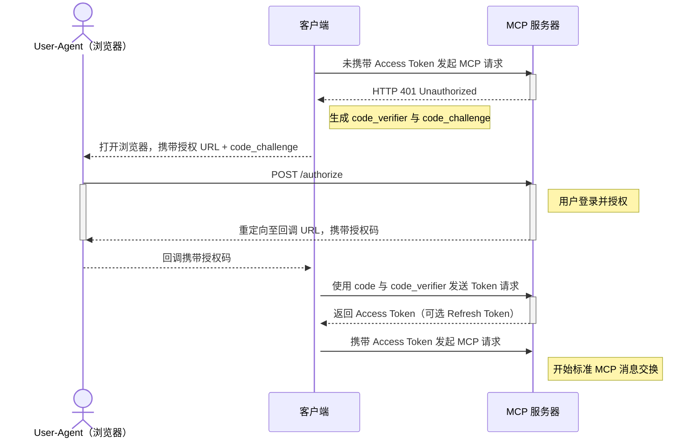
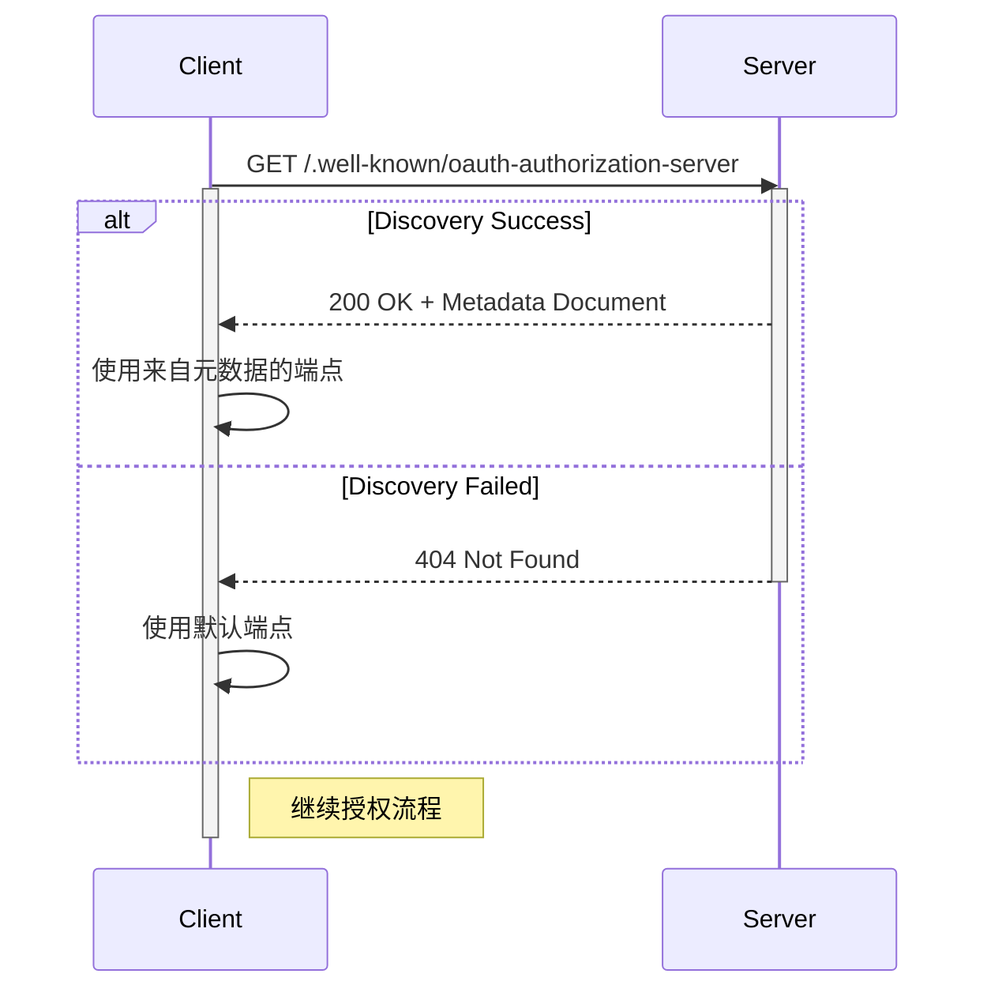
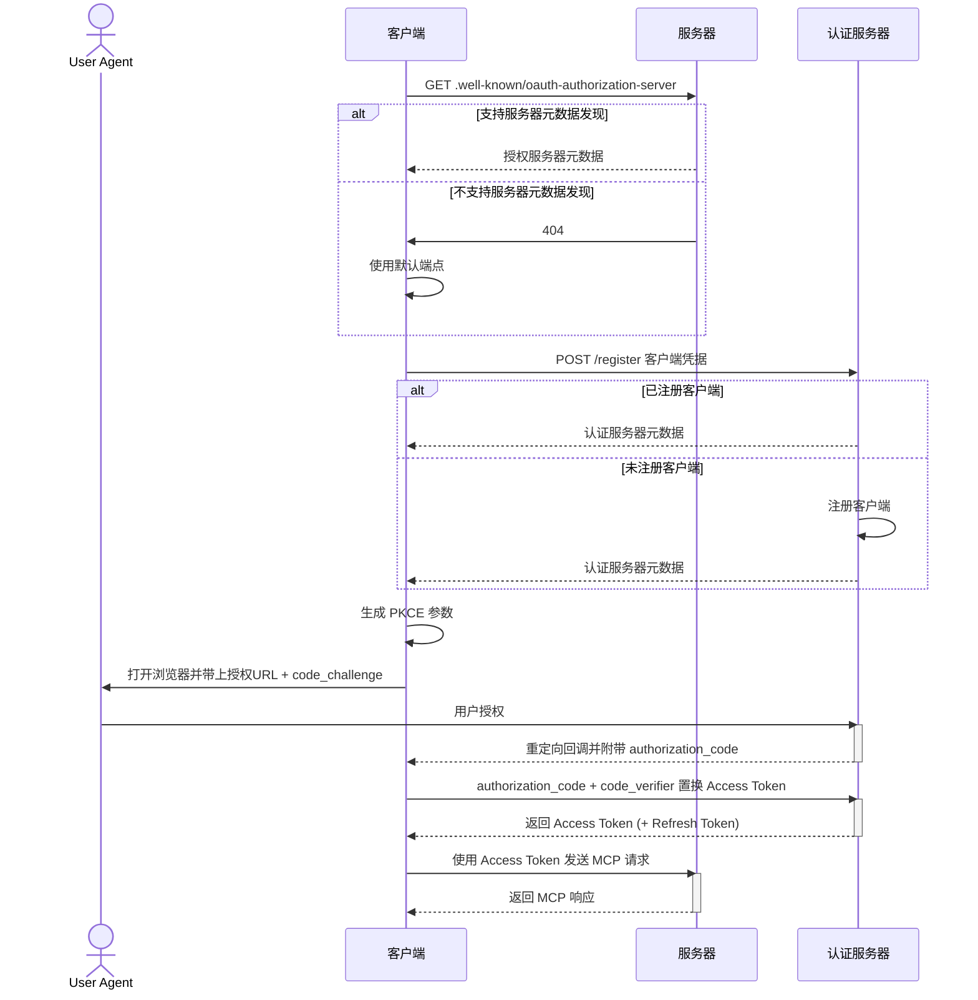

_[MCP（Model Context Protocol）](https://modelcontextprotocol.io) 是一个用于在大模型（LLM）和应用（Application）之间交互的协议，它定义了大模型和应用之间的交互方式，以及大模型和应用之间的上下文传递方式_。统一模型和应用（其实可以视为工具）之间的交互方式，让大模型可以直接使用在线应用来拓展自身能力。
MCP 从去年 10 月左右被提出，起初只有少部分活跃于 AI 开源社区的开发者关注，后续随着 [Manus](https://manus.im) 突然出现，MCP 也逐渐被大众所熟知。\
在最初，是 [Claude](https://claude.ai/download) 真正的将 MCP 集成到自己的应用中，提供了非常强大的用户体验。随后 [Cursor](https://cursor.sh/)、[Cline](https://cline.ai/)、[n8n](https://n8n.io/) 等主流 AI 工具开始搭乘这次东风。\
开发者们开始通过 STDIO 模式将 MCP Server 注册到 MCP Host 中（其实就是一个 python 脚本）。\
随着大量用户涌入社区，社区开始出现 :term[SSE]{./terms/net#sse} 模式的 MCP Server。当前模式下，MCP 可通过 `http` 或 `https` 协议来访问，并使用 :term[SSE]{./terms/net#sse} 协议来传输数据。
在 HTTP 的传统交互模式下，身份和权限是一个老生常谈的问题，在开发者使用 stdio 模式的时候这一点其实并没有很好体现。当企业想要部署可公开（并不是公网可访问）的 MCP Server 时，身份和权限就变得尤为重要。

<!--truncate-->

## 协议内容

> MCP 官方在 [2025-03-26 的规约](https://modelcontextprotocol.io/specification/2025-03-26/basic/authorization) 中提到了 MCP 的身份认证协议，并指出可借助 :term[OAuth 2.1]{./terms/auth#oauth} 使 MCP Client 可以替代用户访问受限的 MCP Server。

:::note

1. 基于 HTTP 的数据传输实现均**应该**符合该规约。
2. STDIO 依赖本地 Python 环境，故而数据传输**不应该**遵循此规范。
3. 在自定义的传输协议中，**必须**遵循对应协议的规约。

:::

协议参考 [OAuth 2.1 IETF Draft](https://datatracker.ietf.org/doc/html/draft-ietf-oauth-v2-1-01) 声明的最佳实践作为主体框架，\
需要 MCP Server 自行实现 [:ctip[**rfc8414**]{id="OAuth 2.0 Authorization Server Metadata"}](https://datatracker.ietf.org/doc/html/rfc8414) 定义的 `/.well-known/oauth-authorization-server` 端点为 MCP Client 提供认证的*元数据信息*。
当 MCP Client 需要集成多个 MCP Server 时，并不能提前知晓 MCP Server 的认证方式以及*身份服务提供商*，故而 MCP Client 必须支持 [:ctip[**rfc7591**]{id="OAuth 2.0 Dynamic Client Registration Protocol"}](https://datatracker.ietf.org/doc/html/rfc7591) 动态注入能力，这样即可无缝集成多个 MCP Server。

:::nerd

如果 Client 泄漏，那么如何保证 Client 不被其他人冒用呢？\
在 [:ctip[**rfc9700**]{id="Best Current Practice for OAuth 2.0 Security"}](https://datatracker.ietf.org/doc/html/rfc9700#name-insufficient-redirection-ur) 中指出可通过**强校验 Redirect URI** 的手段来保证客户端不会被冒用。

:::

```http
HTTP/1.1 200 OK
Content-Type: application/json

{
  "issuer": "https://auth.heliannuuthus.com/:client_id",
  "authorization_endpoint": "https://auth.heliannuuthus.com/:client_id/authorize",
  "token_endpoint": "https://auth.heliannuuthus.com/:client_id/token",
  "token_endpoint_auth_methods_supported": [
    "client_secret_basic",
    "private_key_jwt"
  ],
  "token_endpoint_auth_signing_alg_values_supported": [
    "RS256",
    "ES256"
  ],
  "userinfo_endpoint": "https://auth.heliannuuthus.com/userinfo",
  "jwks_uri": "https://auth.heliannuuthus.com/:client_id/jwks.json",
  "registration_endpoint": "https://auth.heliannuuthus.com/register",
  "scopes_supported": [
    "openid",
    "profile",
    "email",
    "address",
    "phone",
    "offline_access"
  ],
  "response_types_supported": [
    "code",
    "code token"
  ],
  "ui_locales_supported": [
    "en-US",
    "en-GB",
    "en-CA",
    "fr-FR",
    "fr-CA"
  ]
}
```

针对 **MCP 身份验证的实现方** 以及 **MCP Client 和 MCP Server** 存在不同的要求。

**MCP 身份验证的实现方** 须满足：

- **必须**为*机密客户端*或者*公开客户端*实施 OAuth2.1 并且遵循最佳安全实践
- **应该**支持 [:ctip[**rfc7591**]{id="OAuth 2.0 Dynamic Client Registration Protocol"}](https://datatracker.ietf.org/doc/html/rfc7591)

**MCP Client 和 MCP Server** 须满足：

- MCP Client **必须**实现 [:ctip[**rfc8414**]{id="OAuth 2.0 Authorization Server Metadata"}](https://datatracker.ietf.org/doc/html/rfc8414)
- MCP Server **应该**支持 [:ctip[**rfc8414**]{id="OAuth 2.0 Authorization Server Metadata"}](https://datatracker.ietf.org/doc/html/rfc7591)

## 授权流程

该节定义在传统 OAuth 流程中如何进行身份认证，以及在\
[服务器元数据发现](#服务器元数据发现) ([:ctip[**rfc8414**]{id="OAuth 2.0 Authorization Server Metadata"}](https://datatracker.ietf.org/doc/html/rfc8414))\
和[客户端动态注册](#客户端动态注册) ([:ctip[**rfc7591**]{id="OAuth 2.0 Dynamic Client Registration Protocol"}](https://datatracker.ietf.org/doc/html/rfc7591))\
不同场景下 MCP Client 和 MCP Server 如何进行身份认证。

### 授权类型

OAuth 定义了多种授权类型，在 OAuth 2.1 中舍弃掉了 `implicit` 和 `password` 类型。MCP 中用到了两种类型：

- :ctip[**authorization_code**]{#授权码模式}: 需要用户登录授权，用于客户端代表用户本身去完成一些操作。
- :ctip[**client_credentials**]{#客户端凭据模式}: 不需要用户登录授权，用于客户端代表自己去做一些*自动化的操作*。

在 MCP Client 未经授权访问受限的 MCP Server 时，MCP Server 应当返回 **401 Unauthorized** 状态码，MCP Client 应当在收到 **401 Unauthorized** 状态码之后主动*发起授权流程*。

### 传统授权

在 :ctip[**rfc9700**]{id="Best Current Practice for OAuth 2.0 Security"} 中声明，公开的客户端（_通常没有应用密钥_）应使用 PKCE 模式发起认证，并且认证服务器应该进行**强制校验**。



### 服务器元数据发现

> MCP Client **必须支持**获取和解析 [:ctip[**rfc8414**]{id="OAuth 2.0 Authorization Server Metadata"}](https://datatracker.ietf.org/doc/html/rfc8414) 返回的数据，\
> 并且需要实现对应的数据的获取以及授权流程的发起和中转。

- MCP Client 应当在获取 MCP Server 授权元数据时携带 `MCP-Protocol-Version: <protocol-version>` 标头，以声明自己支持的 MCP 认证协议的版本。
- MCP 必须根据 MCP Server URL 来确定 Base URL，方法是丢弃掉 URL 中的路径和查询参数。**一定要确保授权端点始终位于托管 MCP Server 的根域下**。下面是一个例子：
  - `https://auth.heliannuuthus.com/v1/mcp` 为 MCP Server 在 MCP Host 注册的地址
  - 则 Base URL 为 `https://auth.heliannuuthus.com`
  - 服务器元数据端点为：`https://auth.heliannuuthus.com/.well-known/oauth-authorization-server`
- 当没有发现服务器元数据端点时，MCP Client 会使用**默认端点**：
  | 端点类型 | 默认路径 | 描述 |
  | ---------------------- | ------------ | --------------------- |
  | authorization_endpoint | `/authorize` | 用于发起授权请求的端点 |
  | token_endpoint | `/token` | 用于获取凭证的端点 |
  | registration_endpoint | `/register` | 用于客户端动态注册的端点 |

- 服务器元数据发现整体交互图如下：



### 客户端动态注册

> 通常 MCP Client 并不知道自己将要访问的 MCP Server 背后是哪个*认证服务提供商*，也并不知道自己是否已经在对应的认证服务器注册过。因此 MCP Client 期望通过*客户端动态注册*的方式来向认证服务器*注册/获取*自己的信息。

动态注册主要为了解决以下问题：

1. MCP Client 如果依赖于用户手动注册，这么过程会非常繁琐。
2. MCP Client 和**新的 MCP Server** 之间能通过这种方式完全自动化的完成接入。
3. MCP Server 可以自定义[服务器元数据发现](#服务器元数据发现)中的注册端点来**自定义客户端动态注册逻辑**。

:::info

如果 MCP Server （或者认证服务提供商）并不支持动态注册，那么需要由 MCP Client 对当前 MCP Server 采取定制化接入，以下方案仅供参考：

- 针对该 MCP Server 进行 Client ID 的硬编码
- 向用户展示一个页面，允许用户手动在认证服务提供商注册完客户端后，将注册的 Client ID 填写到页面中
- MCP Server 和 MCP Client 通过 HTTP 传统交互模式来获取一些信息（可基于密码学保证数据的安全性和合法性，此处不展开）

:::

综上所述，完整的 MCP 认证授权交互图如下：



### 访问凭据

#### 使用规则

> 完成授权流程后，MCP Client 能直接从 Auth Server 获取到 _Access Token_，即 MCP Client 可替代用户访问受限 MCP Server 的凭证。

- MCP Client 使用凭证时必须放在请求头 `Authorization` 中

  ```http
  Authorization: Bearer <access_token>
  ```

- 访问凭证不能放在请求参数内，包括 query 和 body

- MCP Server 必须强制对凭证进行校验，如果验证失败，必须返回 **401 Unauthorized** 状态码。无效或过期的凭证必须被拒绝，也返回 **401 Unauthorized** 状态码。

:::tip

1. 访问凭证**必须**按照 :ctip[**rfc9700**]{id="Best Current Practice for OAuth 2.0 Security"} 的最佳实践进行存储保管
2. 授权端点**必须**以 `HTTPS` 协议来承载，保证通信的安全性
3. 授权服务器**应该**支持访问凭证的*强制轮换*和*强制吊销*
4. 授权服务器**必须**强制验证重定向 URL 的合法性，重定向 URL 必须是 `HTTPS` 或者 `localhost`
   :::
