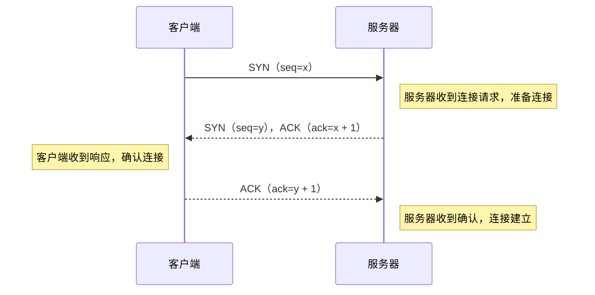
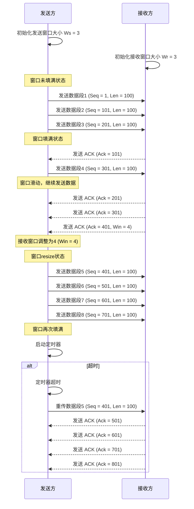

> TCP 是传输控制协议（Transmission Control Protocol）的缩写，是一种面向连接的、可靠的、基于字节流的传输层通信协议。

## 特点

- **面向连接**：在开始数据传输前，通信双方需要建立连接
- **可靠性**：基于通信双方的 :ctip[**ACK**]{title="Acknowledge character"} 机制实现数据包重传
- **有序性**：发送方发送数据包发送会携带序列号，接收方可根据序列号排序，即使中间数据包丢失再重传后仍可恢复顺序
- **流量控制**：基于:term[滑动窗口协议]{./blog/terms/net#sliding-window-protocol}，控制数据传输的流量，避免拥塞发生

---

slug: sliding-window-protocol
title: 滑动窗口协议
description: 滑动窗口协议属于 TCP 协议的一种应用，用于控制网络传输的流量，避免拥塞发生。

---

> 滑动窗口协议（Sliding Window Protocol），又称 TCP 滑动窗口协议（TCP Sliding Window Protocol），是 TCP 协议的一种应用，用于控制网络传输的流量，避免拥塞发生。

该协议允许发送方同时发送多个数据包而不用每次发送都等待回复确认，提高了网络传输的效率和吞吐量。

1. 在 :term[**TCP 三次握手**]{./blog/terms/net#tcp} 结束后发送方和接收方会协商出一个*初始窗口*

   - 在后续的数据传输过程中，发送方和接收方会根据当时的网络情况在 ACK 报文中携带调整后的窗口大小。

2. 发送放会根据接收方的窗口大小**不等待**的发送数据包，当达到窗口大小时会等待接收方 ACK

   - 在接收方 ACK 后，滑动窗口会开始滑动，发送方会由于滑动窗口未满继续发送数据包

